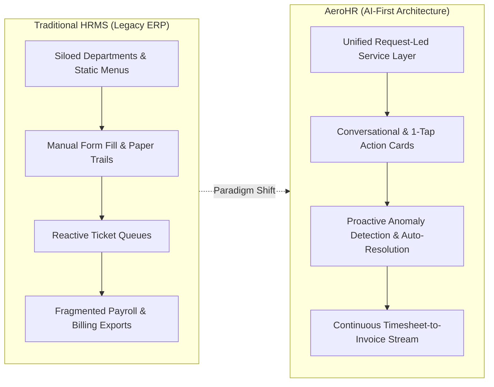
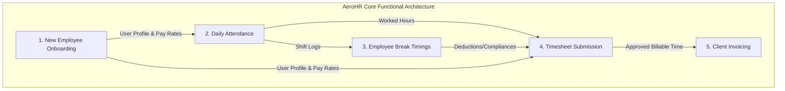
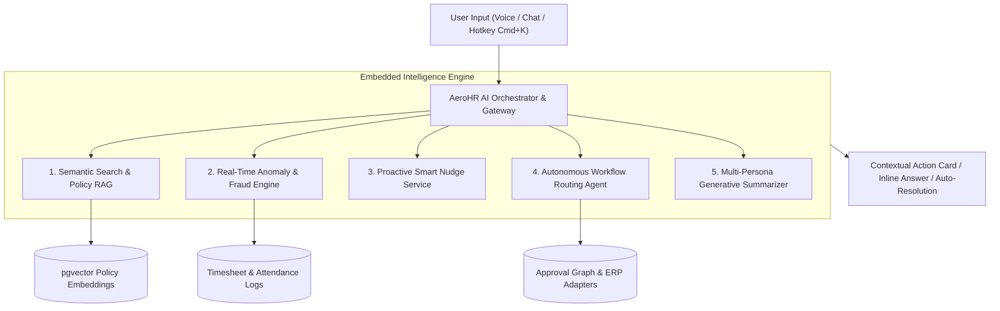
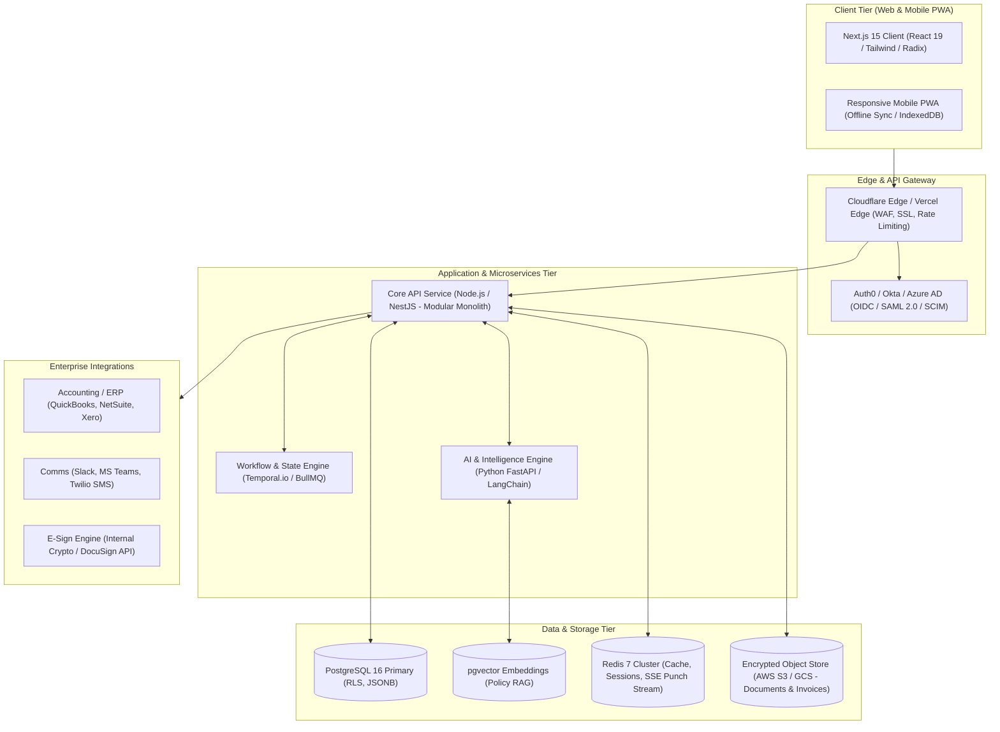
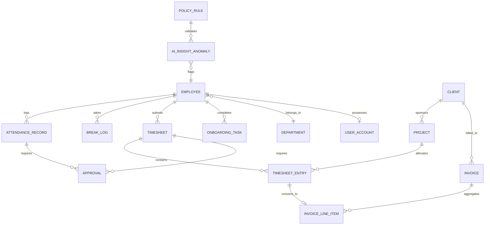
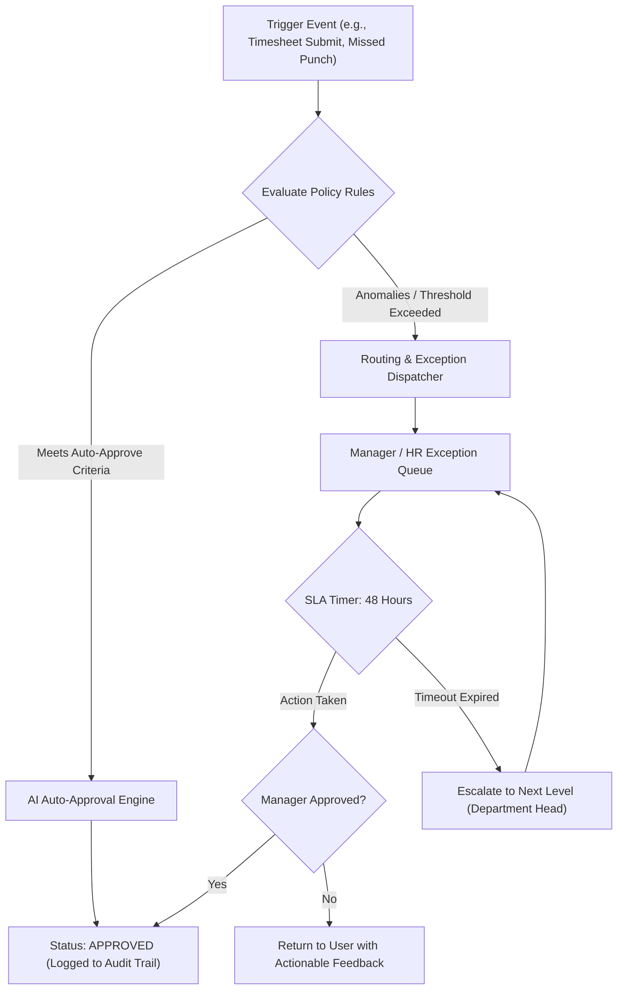
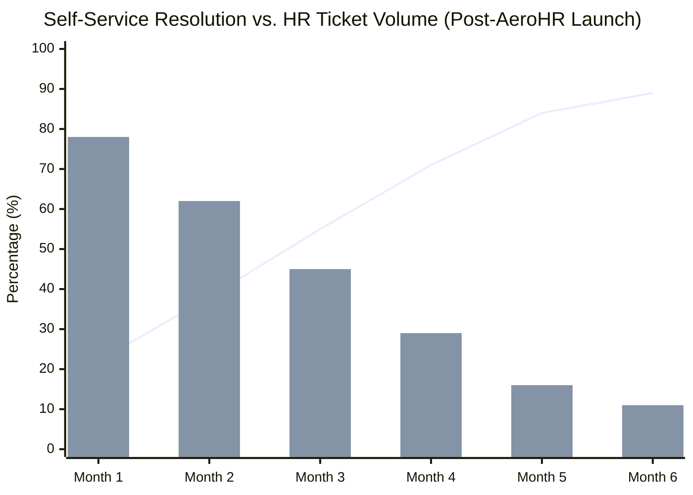
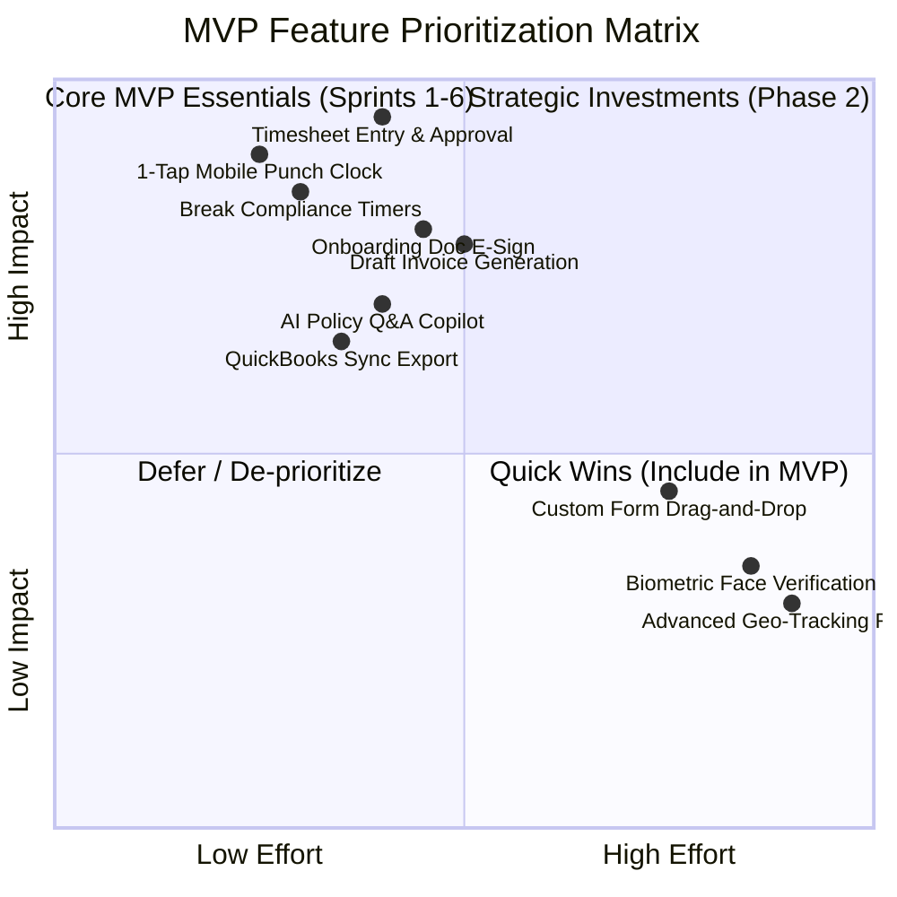
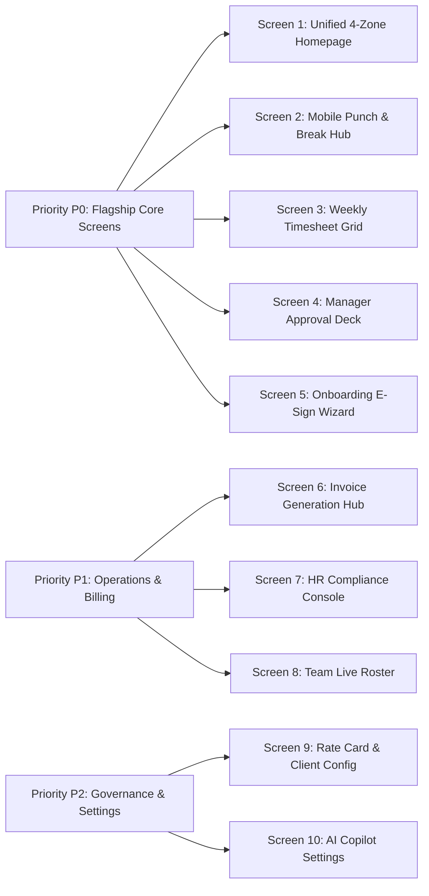

# Pure AI HR Portal: Product Strategy, Architecture & Delivery Plan
**Project Codename:** *AeroHR* | **Target Segment:** Mid-Market Enterprise (100 – 2,500 Employees)  
**Document Version:** 1.0.0 | **Author:** Principal Product Strategist & Enterprise Solutions Architect  

---

## 1. Product Vision

### 1.1 Executive Product Definition
**AeroHR** is an **AI-first Workforce Operating System** engineered to collapse the operational distance between employees, managers, people operations, and finance. Rather than functioning as a passive repository of bureaucratic forms and static tables, AeroHR is designed as an active, contextual co-pilot that anticipates workforce events, automates routine compliance, and streamlines five critical operational pillars: **New Employee Onboarding**, **Daily Attendance**, **Break Timings**, **Timesheet Submission**, and **Client Invoicing**.

Built for organizations navigating modern hybrid, remote, and distributed work patterns, the platform turns administrative friction into self-driving workflows. Every viewport features an ambient intelligence layer that eliminates dead-end navigation, decodes complex labor policies, detects anomalies before they reach payroll or billing, and enables employees to complete 90% of recurring HR tasks via natural-language interaction or 1-tap contextual actions.

### 1.2 Target User Personas & Value Matrix

| Persona | Core Pain Points | Value Delivered by AeroHR |
| :--- | :--- | :--- |
| **Employees** (Full-time, Contract, Hourly) | Tedious manual timesheet entry, unclear break compliance rules, fragmented onboarding portals, slow support ticket responses. | **Zero-effort self-service**: 1-tap mobile punch clocks, automated break reminders, conversational policy answers, and predictive timesheet pre-fills. |
| **People Managers** | Time spent policing timesheets, manual attendance exception approvals, disjointed onboarding check-ins. | **Management by exception**: AI-aggregated weekly team summaries, 1-click batch approvals with anomaly callouts, and automated milestone tracking. |
| **HR & People Operations** | Manual document chasing, non-compliance with regional break/overtime laws, high deflection friction on repetitive inquiries. | **Continuous compliance & zero-touch onboarding**: Automated e-sign workflows, proactive risk alerts, and >75% Tier-1 HR query deflection. |
| **Finance & Billing Ops** | Disconnected time tracking and client invoicing, manual billable hour auditing, delayed revenue cycles, billing disputes. | **Instant timesheet-to-invoice pipeline**: Automated rate-card mapping, contract cap validation, draft invoice generation, and ERP export. |
| **Executive Leadership (C-Suite)** | Opaque labor utilization, budget creep, employee attrition blind spots, slow workforce operational velocity. | **Predictive organizational health**: Real-time workforce telemetry, utilization forecasting, burn-rate visibility, and compliance audit readiness. |

### 1.3 Strategic Differentiation: Traditional HRMS vs. Pure AI Portal



Traditional human resource management systems (e.g., legacy SAP, older Workday configurations, ADP, BambooHR) treat the portal as a digital filing cabinet. Employees navigate complex menus organized by HR department hierarchies, fill out exhaustive forms, and wait days for human ticket handlers.

AeroHR reverses this paradigm:
1. **Request-Led & Shallow Architecture**: Users never navigate by department ("Payroll", "Benefits", "Legal"). Instead, the architecture is indexed by *jobs-to-be-done* ("Clock In", "Log Break", "Submit Week", "Review Invoices").
2. **Proactive Ambient Intelligence**: The system does not wait for user input. If an employee is nearing a mandatory meal break window under California labor law, AeroHR nudges them before a compliance violation occurs. If Friday at 4 PM arrives with unlogged client hours, the AI pre-populates timesheets based on calendar meetings and commits them for approval.
3. **Conversational Action Layer**: The AI assistant is not an isolated chatbot iframe; it possesses execution privileges bounded by strict authorization scopes. Users can say, *"Generate Acme Corp's August invoice using billable rate card B"*, and receive an editable draft in under three seconds.

---

## 2. Core Modules Specification



---

### 2.1 Module 1: New Employee Onboarding

#### Overview
A zero-anxiety onboarding command center that guides new hires from pre-boarding offer acceptance to Day-90 autonomy, orchestrating document collection, identity verification, compliance e-signatures, hardware provisioning, and peer buddy integration.

* **Primary Roles**: New Hire, Hiring Manager, HR Operations, IT Systems Admin, Assigned Buddy.
* **Key Workflows**:
  1. *Pre-boarding Portal Activation*: Single-use magic link authentication, personal data collection, emergency contacts, tax declarations (W-4, I-9, regional equivalents).
  2. *Cryptographic Document Execution*: Built-in e-signature for NDAs, IP agreements, Employee Handbook acknowledgment with auto-generated audit stamps.
  3. *Zero-Touch Provisioning Checklist*: Automated provisioning tickets (Google Workspace, Slack, Jira, GitHub) synced to IT asset tags.
  4. *Adaptive 30-60-90 Day Roadmap*: Role-specific milestone tracking, automated syncs with the assigned buddy, and AI-suggested training modules.
* **Inputs & Outputs**:
  * *Inputs*: Government IDs, banking routing details, signed agreements, profile questionnaires, completed checklists.
  * *Outputs*: Cryptographically signed PDF records, provisioned user accounts, calendar check-in invites, Day-1 readiness score.
* **Approvals & Governance**:
  * I-9 / Identity verification approval by HR Operations.
  * Equipment delivery confirmation by Employee and IT Admin.
* **Automations & Notifications**:
  * Smart nudges sent via Email/SMS 3 days prior to Day 1 if tax declarations are pending.
  * Welcome notification pushed to team Slack/Teams channel upon completion of Day 1 setup.
* **Exceptions & Handling**:
  * *Expired/Illegible ID upload*: Computer vision flag triggers real-time prompt to re-upload with clear framing guidelines.
  * *Stalled Onboarding*: AI alerts HR manager if completion velocity drops below 50% by Day 3.

---

### 2.2 Module 2: Daily Attendance

#### Overview
A lightweight, friction-free attendance engine that tracks presence across remote, hybrid, and on-premises modalities with transparent verification, shift policies, and automated grace periods.

* **Primary Roles**: Employee, Direct Manager, HR Ops, Payroll Admin.
* **Key Workflows**:
  1. *Contextual Clock-In/Clock-Out*: 1-tap web and mobile punch widget with device fingerprinting and optional geo-fence/IP subnet validation.
  2. *Grace-Period & Shift Enforcement*: Automated application of configurable grace periods (e.g., 10-minute flex buffer before marking "Late Arrival").
  3. *Regularization & Missed Punch Requests*: Employee submits missing punch request; AI cross-references calendar events or laptop activity logs to suggest punch times to the approving manager.
  4. *Overtime & Half-Day Calculation*: Automatic tagging of straight time, 1.5x overtime, 2.0x double-time based on local jurisdictional rules.
* **Inputs & Outputs**:
  * *Inputs*: Geolocation (optional/soft), IP address, device metadata, timestamp, punch type (In/Out/Transfer).
  * *Outputs*: Daily raw attendance records, normalized worked hours, daily status flag (`Present`, `Late`, `Half-Day`, `Excused`, `Unexcused`).
* **Approvals & Governance**:
  * Standard punch: Zero approval required (self-service record).
  * Attendance regularizations / missed punch adjustments: Requires direct manager sign-off.
* **Automations & Notifications**:
  * Auto-clock-out warning sent to mobile if an active shift exceeds 12 continuous hours without logout.
  * Push reminder 5 minutes before scheduled shift start for shift-based workers.
* **Exceptions & Handling**:
  * *Geo-fence mismatch*: Soft warning logged in audit trail without blocking clock-in, alerting manager to review.
  * *Unplanned Absence*: If no punch occurs 60 minutes after scheduled shift, manager receives an alert and AI prompts employee for status update.

---

### 2.3 Module 3: Employee Break Timings

#### Overview
A precision compliance module ensuring rest and meal periods conform to statutory labor standards (FLSA, California Labor Code, UK Working Time Regulations) while preventing burnout and shift fatigue.

* **Primary Roles**: Employee, Direct Manager, Compliance Auditor.
* **Key Workflows**:
  1. *1-Tap Break Activation*: Quick-select break type: *Rest Break (Paid, 15m)*, *Meal Break (Unpaid, 30–60m)*, *Wellness Break*.
  2. *Live Countdown & Non-Intrusive Timers*: Visual, ambient progress indicator on mobile and desktop showing remaining break allowance.
  3. *Statutory Break Window Warnings*: System alerts employees 30 minutes prior to the mandatory 5th-hour meal break threshold (California compliance).
  4. *Break End & Resume Punch*: Seamless transition back into active shift state with single-action tap.
* **Inputs & Outputs**:
  * *Inputs*: Break start timestamp, break type, break end timestamp, employee waiver toggle (if applicable).
  * *Outputs*: Structured break intervals, paid vs. unpaid hours calculated, compliance verification tokens.
* **Approvals & Governance**:
  * Routine breaks: Automated capture.
  * Break waivers or meal-period penalties: Flagged for HR compliance audit.
* **Automations & Notifications**:
  * Warning alert sent 5 minutes before break expiration: *"Your meal break concludes in 5 minutes. Tap to extend or resume work."*
  * Over-break threshold alert: If unpaid break exceeds scheduled duration by >15 minutes, manager receives notification.
* **Exceptions & Handling**:
  * *Missed Statutory Meal Break*: System automatically logs potential meal-break premium penalty (1 hour straight pay) and routes incident to HR review queue.

---

### 2.4 Module 4: Timesheet Submission

#### Overview
An intelligent work allocation logging system that captures task, project, and client-level hours with minimal cognitive overhead, featuring AI-assisted pre-fills and automated project budget checks.

* **Primary Roles**: Employee, Project Manager, People Manager, Finance Controller.
* **Key Workflows**:
  1. *Multi-Modal Time Entry*: Grid view, calendar sync view, or natural-language prompt entry (*"Log 4 hours on Acme Corp Frontend and 4 hours on Beta Internal"*).
  2. *Billable vs. Non-Billable Allocation*: Direct linkage to active client projects, work packages, and task billing codes.
  3. *Overtime & Budget Pre-validation*: Real-time validation against client budget caps and weekly statutory overtime thresholds.
  4. *Friday One-Click Submission*: AI assembles time records, highlights variances vs. attendance punches, and submits for dual-tier approval.
* **Inputs & Outputs**:
  * *Inputs*: Project ID, Task code, Date, Hours, Work notes, Billable toggle.
  * *Outputs*: Weekly consolidated timesheet object, approval tokens, auditable change log.
* **Approvals & Governance**:
  * Dual-Tier Routing: Project Manager approves project-specific hours; People Manager approves total weekly work capacity.
  * Auto-approval rule: Submissions with 100% attendance match and zero overtime variance auto-approve if configured by organization policy.
* **Automations & Notifications**:
  * Nudge sent Friday at 3:00 PM to unsubmitted users: *"You have 34 hours logged across 4 projects. 6 hours remain to match your scheduled 40h."*
  * Manager batch notification on Monday at 9:00 AM summarizing team submissions.
* **Exceptions & Handling**:
  * *Attendance vs. Timesheet Discrepancy*: If logged timesheet exceeds clocked attendance by >1 hour, submission is flagged for mandatory explanation before submission.

---

### 2.5 Module 5: Invoicing

#### Overview
A frictionless billing pipeline that converts approved timesheets directly into audit-ready client invoices with automated rate-card enforcement, tax calculation, and multi-format ledger exports.

* **Primary Roles**: Finance Manager, Account Executive, Client Billing Contact, Super Admin.
* **Key Workflows**:
  1. *Automated Draft Invoice Generation*: Continuous aggregation of approved billable timesheets grouped by Client, Project, and Billing Cycle (Weekly/Bi-Weekly/Monthly).
  2. *Rate-Card & Contract Cap Calculation*: Dynamic application of hourly rates, blended team rates, fixed-fee milestones, and cap limits.
  3. *Review, Adjustment & Line-Item Drill-Down*: Visual inspection interface allowing finance to adjust hours, apply discounts, or unbundle line items with full audit traceability.
  4. *Client Dispatch & ERP Sync*: One-click dispatch via PDF/email and bi-directional synchronization with QuickBooks Online, NetSuite, Xero, or Stripe.
* **Inputs & Outputs**:
  * *Inputs*: Approved timesheet entries, client rate-cards, discount rules, tax rates, payment terms (Net-15, Net-30).
  * *Outputs*: Professional PDF invoice, UBL/e-Invoice XML, ERP sync payload, client payment link.
* **Approvals & Governance**:
  * Finance Controller sign-off required for invoices exceeding \$25,000 or carrying manual line-item rate adjustments.
* **Automations & Notifications**:
  * Automatic generation of draft invoices on the 1st and 15th of every month.
  * Overdue payment dunning emails triggered automatically at Net+3, Net+7, and Net+14 days post-due date.
* **Exceptions & Handling**:
  * *Contract Budget Overrun*: If billable hours exceed client purchase order (PO) budget cap, the system freezes excess hours into an *Unbilled Exceptions Queue* and alerts the Account Director.

---

## 3. Pure AI Capabilities: Embedded Intelligence Architecture



### 3.1 Omnipresent Conversational AI Assistant (*Aero Copilot*)
* **Docked & Ubiquitous**: Accessible via floating panel, persistent sidebar, or global keyboard shortcut (`Cmd+K` / `Ctrl+K`).
* **Context-Aware Memory**: The assistant automatically detects the user's current viewport. If open on `/timesheets/week-42`, the prompt context automatically includes the current draft entries, unassigned hours, and project assignments.
* **Action-Executing Abilities**: Beyond answering questions, the assistant executes mutations via validated function calls (e.g., `execute_clock_out()`, `approve_timesheet_batch([id1, id2])`, `generate_client_invoice(clientId, cycle)`).

### 3.2 Natural-Language Semantic Search & Knowledge Retrieval
* **Zero-Keyword Barrier**: Users query HR rules in plain language (*"What is our parental leave policy for secondary caregivers?"* or *"Can I bill travel hours to client Acme?"*).
* **Grounding via RAG**: The system vectorizes employee handbooks, client contracts, and SOPs into `pgvector`, providing cited, hallucination-free answers with direct links to internal policy sections.
* **Task-Integrated Answers**: Surfaced inline during task completion (e.g., when an employee selects "Sick Leave", a tooltip outlines remaining balance and medical certificate requirements without leaving the form).

### 3.3 Personalized Task Recommendations
* **Role & Tenure Weighting**: A Day-2 new hire receives recommended actions centered on badge pickup and IT MFA setup; an engineer with 4 years tenure sees Friday timesheet submission and project allocation updates.
* **Dynamic Home Reordering**: High-priority, time-sensitive cards automatically bubble to the top of the interface.

### 3.4 Proactive Smart Nudges
* **Predictive Pre-Fills**: Evaluates Google Calendar / Outlook events to suggest: *"You attended 6 hours of Client Beta sprint ceremonies this week. Should we log these to Project Beta?"*
* **Compliance Pre-Emption**: Nudges managers 24 hours prior to payroll lock if unreviewed timesheets will block pay disbursement.

### 3.5 Real-Time Anomaly & Fraud Detection
* **Dual-Input Cross-Validation**: Flags timesheets where logged hours exceed clocked attendance duration by >10%.
* **Shift Pattern Outliers**: Identifies erratic clock-ins (e.g., punch-in from an IP located 3,000 miles away from previous session without VPN flag).
* **Billing Discrepancies**: Alerts finance if billable project hours deviate by >25% from the rolling 4-week project median.

### 3.6 Generative Summaries for Leadership & Managers
* **Manager Weekly Digest**: *"Team Alpha logged 382 hours across 4 client projects. 12 hours overtime logged by John Doe (Project Apex deadline). Zero break compliance violations."*
* **Executive Pulse**: Summarizes organizational onboarding velocity, open headcount completion rates, and average invoice settlement cycles.

---

## 4. UX and Design Direction

### 4.0 Login Page Specification & Enterprise Authentication Lifecycle
The portal enforces a secure, welcoming, and calm split-screen login entry point that immediately routes users into their tailored role dashboard upon credential validation.

```mermaid
flowchart TD
    User([User Lands on Portal]) --> CheckAuth{Session Active?}
    CheckAuth -->|No| LoginScreen[Dedicated Login Viewport]
    CheckAuth -->|Yes| FetchRole[Fetch Role & Scopes]
    
    LoginScreen --> InputCreds[Enter Work Email & Password / SSO]
    InputCreds --> ValidateAuth{Validate Auth}
    ValidateAuth -->|Failed| LockoutCheck{>=5 Failed Attempts?}
    LockoutCheck -->|Yes| AccountLocked[Show Account Locked / Reset Flow]
    LockoutCheck -->|No| ShowError[Show Inline Credential Error]
    
    ValidateAuth -->|Success| FetchRole
    
    FetchRole --> RoleSwitch{Evaluate Role}
    RoleSwitch -->|EMPLOYEE| EmpDash[/dashboard/employee: Self-Service Canvas]
    RoleSwitch -->|HR| HRDash[/dashboard/hr: Onboarding & Compliance Console]
    RoleSwitch -->|ADMIN| AdminDash[/dashboard/admin: Executive Command Center]
    
    EmpDash -.->|Unauthorized Access Attempt| GuardModal[403 Access Denied Modal]
    HRDash -.->|Unauthorized Access Attempt| GuardModal
```

#### Login Page Components
* **Split-Screen Layout**:
  * *Left Hero Brand Pane*: Deep navy gradient background (`#0F172A` to `#1E293B`), glowing AeroHR monogram, trust badges (SOC 2 Type II, GDPR, FLSA), and value pillars (1-Tap Attendance, Calendar Pre-Fill, Invoicing, Pure AI Assistance).
  * *Right Form Pane*: Modern enterprise card containing:
    1. Logo & Welcome Header: *"Sign in to your portal"* with trust-building microcopy.
    2. Work Email Input with real-time format validation.
    3. Password Input with interactive Show/Hide eye toggle.
    4. "Remember this device" checkbox & "Forgot password?" self-service recovery link.
    5. Primary Sign-In Button with loading spinner state and failed attempt rate-limiting.
    6. Single Sign-On (SSO) placeholder (*"Continue with Enterprise SSO - Okta / Google Workspace"*).
    7. **1-Click Demo Persona Cards**:
       * 👤 **Employee**: `employee@demo.com` (Alex Chen)
       * 📋 **HR Ops**: `hr@demo.com` (Marcus Vance)
       * 👑 **Admin**: `admin@demo.com` (Sarah Jenkins / Super Admin)
    8. Light / Dark mode toggle button.

#### Session Lifecycle & Route Guarding
* **Strict Role-Based Routing**: After authentication, users are redirected exclusively to their designated dashboard.
* **403 Forbidden State**: If an Employee attempts to navigate to Admin System Settings or Security Audit Vault, the system renders a non-intrusive **403 Forbidden Modal** explaining the permission boundary and providing an access request workflow.
* **Session Timeout Guard**: Background idle timer automatically locks the session after 30 minutes of inactivity, prompting a clean **Session Expired Modal** that gracefully returns the user to the login screen without losing unsaved draft work.

### 4.1 Role-Aware Homepage: The 4-Zone Adaptive Canvas
The homepage eliminates dashboard clutter by organizing every user’s operational day into four distinct visual zones:

```
+-----------------------------------------------------------------------------------------------+
|  AEROHR  [Search tasks, policies, people... (Cmd+K)]                [Notifications] [Profile] |
+-----------------------------------------------------------------------------------------------+
|  ZONE 1: PENDING ACTIONS (Urgent, SLA-driven items requiring immediate input)                  |
|  [!] 2 Timesheets awaiting approval  |  [!] Review California Meal Break Exception for Alex K. |
+-----------------------------------------------------------------------------------------------+
|  ZONE 2: IN-PROGRESS ITEMS (Current shift context & active items)                              |
|  [ Shift Active: 04h 12m ] -> [ Take Break ] [ Clock Out ]  |  [ Weekly Timesheet: 32/40h ]   |
+-----------------------------------------------------------------------------------------------+
|  ZONE 3: RECOMMENDED TASKS (AI nudges, learning paths, upcoming milestones)                   |
|  * Pre-fill Friday timesheet from calendar (6 events found)                                   |
|  * Complete Cyber Security Refresher (Due in 4 days)                                          |
+-----------------------------------------------------------------------------------------------+
|  ZONE 4: AMBIENT AI COPILOT & QUICK ACTIONS                                                    |
|  "Ask Aero anything..."  | [ 1-Tap Log Time ] [ Regularize Punch ] [ Request Leave ]           |
+-----------------------------------------------------------------------------------------------+
```

### 4.2 Design System Principles
* **Visual Language**: Modern Enterprise Calm. Soft slate backgrounds (`#F8FAFC`), deep navy typography (`#0F172A`), high-contrast primary accents (`#2563EB`), and strict functional status indicators (Success: `#10B981`, Warning: `#F59E0B`, Danger: `#EF4444`).
* **Shallow Navigation (Request-First)**: Every core workflow is accessible within a maximum of 2 clicks from the root.
* **Density Control**: Compact mode for power users (Finance, HR Ops) and comfortable touch-friendly mode for mobile-first field workers.
* **Component-Level States**:
  * *Empty States*: Provide generative prompts (e.g., *"No invoices in draft. Would you like Aero to scan this week's approved timesheets to generate drafts?"*).
  * *Loading States*: Fluid skeleton screens matching exact typographic layout; zero blocking spinner overlays.
  * *Error States*: Inline explanations accompanied by automated recovery suggestions.

### 4.3 Mobile-First Touch Target Specification
* **48px Minimum Hit Targets**: Primary clock-in and break-logging actions are full-width floating bottom sheets on mobile viewports.
* **Offline-Resilient Punching**: Clock-in and break-toggle operations succeed immediately offline, queueing in IndexedDB and syncing seamlessly upon reconnect with cryptographic timestamps.

### 4.4 Accessibility (a11y) & Multilingual Support
* **WCAG 2.2 Level AA Compliance**: Contrast ratios >4.5:1 for standard text, full keyboard navigation with visible focus rings (`ring-2 ring-blue-500`), screen-reader ARIA live regions for active punch timers.
* **Native Localization (i18n)**: Out-of-the-box support for English, Spanish, French, German, and Japanese with localized date, currency, and numerical formatting.

---

## 5. Detailed End-to-End User Journeys

```mermaid
sequenceDiagram
    autonumber
    actor Employee as New Hire / Employee
    actor Manager as People / Project Manager
    participant App as AeroHR Web/Mobile
    participant AI as Aero AI Service
    actor Finance as Finance Controller

    %% Journey 1: Onboarding
    Note over Employee, App: Journey 1: Week 1 Onboarding
    Employee->>App: Clicks Magic Link from Welcome Email
    App->>AI: Fetches profile & country policy
    AI-->>App: Generates customized Day-1 task graph
    Employee->>App: Uploads Photo of State ID
    App->>AI: Optical Character Recognition & Verification
    AI-->>App: Confirms validity & auto-populates I-9
    Employee->>App: 1-Tap Cryptographic E-Sign
    App-->>Manager: Notifies Manager: "New hire 100% Day-1 ready"

    %% Journey 2: Daily Attendance & Breaks
    Note over Employee, App: Journey 2: Daily Attendance & Break Cycle
    Employee->>App: Tap "Clock In" (09:00 AM)
    App->>App: Captures timestamp & device token
    Note over Employee, App: At 1:00 PM (4th hour of shift)
    AI-->>App: Nudge: "Statutory 30m meal break due in 45m"
    Employee->>App: Tap "Start Meal Break"
    App->>App: Suspends active shift timer; initiates countdown
    Employee->>App: Tap "End Break & Resume Shift" (1:32 PM)
    App->>AI: Checks compliance: 32m unpaid meal break (Compliant)

    %% Journey 3: Weekly Timesheet Submission
    Note over Employee, Manager: Journey 3: Weekly Timesheet Submission
    AI->>Employee: Friday Nudge: "Draft timesheet ready based on your 38 clocked hours"
    Employee->>App: Reviews pre-filled project hours & clicks "Submit"
    App->>AI: Runs Anomaly Scan: Overtime, Budget Caps, Attendance Match
    AI-->>Manager: Anomaly Free: "1-Click Batch Approve available"
    Manager->>App: Approves timesheet with 1 tap

    %% Journey 4: Invoice Generation
    Note over Finance, App: Journey 4: Billable Invoicing
    AI->>Finance: Alerts: "Cycle closed: $84,200 billable time ready for Acme Corp"
    Finance->>App: Opens Invoice Hub & reviews line-items
    Finance->>App: Clicks "Generate & Sync to NetSuite"
    App->>Finance: Dispatches invoice PDF with payment link to client
```

### Detailed Journey Specifications

#### Journey 1: New Hire Completing Onboarding (Week 1)
* **Trigger**: Candidate accepts job offer; system triggers onboarding initialization event.
* **Steps**:
  1. New hire authenticates via magic link with two-factor SMS/email challenge.
  2. Greets user with personalized video message from Hiring Manager and 4-step wizard.
  3. User uploads government identification; AI validates clarity and pre-fills tax forms.
  4. User signs agreements using cryptographic browser signature.
  5. Selects hardware preference; automated webhook creates Jira Service Desk IT asset ticket.
* **Decision Points**: If ID fails OCR validation, user is prompted with an interactive cropping tool.
* **AI Intervention**: AI scans completed documents for missing signatures; answers questions regarding health insurance deductibles in real-time.
* **Success Outcome**: 100% compliance documentation secured; user provisioned in all systems 48 hours prior to Day 1.

#### Journey 2: Employee Daily Attendance & Break Logging (Full Shift Cycle)
* **Trigger**: Employee begins scheduled working day.
* **Steps**:
  1. Opens mobile app or browser bookmark; large primary action button reads: `Clock In (Shift Start)`.
  2. Tap executes instant punch-in; system confirms location integrity silently.
  3. At hour 4.5 of shift, ambient banner alerts user to upcoming meal break threshold.
  4. Employee taps `Start Lunch Break`; active punch switches to meal timer.
  5. After 30 minutes, employee taps `Resume Shift`; clock restarts.
  6. At end of shift, employee taps `Clock Out`; modal asks for optional daily shift summary.
* **Decision Points**: If employee forgets to clock out, system checks for inactivity and triggers evening notification.
* **AI Intervention**: Detects missed breaks and flags compliant justifications (*"Employee opted to take late lunch due to client release deployment"*).
* **Success Outcome**: Tamper-proof, legally compliant attendance and break log committed without manual calculation errors.

#### Journey 3: Employee Submitting Weekly Timesheet
* **Trigger**: Friday afternoon recurring schedule or 40 clocked attendance hours reached.
* **Steps**:
  1. Employee navigates to Timesheets; view displays visual comparison between clocked attendance hours and logged project hours.
  2. AI presents pre-filled allocation cards inferred from calendar invites and git commit timestamps.
  3. Employee reviews, adjusts 2 hours from "Internal Meetings" to "Client Apollo", and clicks `Submit Timesheet`.
* **Decision Points**: If logged time deviates by >2 hours from attendance clock, user must provide a 1-sentence note.
* **AI Intervention**: Anomaly engine verifies project billing codes are active and PO budget is unexhausted.
* **Success Outcome**: Timesheet transitions to `Submitted` status; routed instantaneously to approving manager.

#### Journey 4: Manager Reviewing Approvals
* **Trigger**: Monday morning notification: *"4 timesheets, 1 attendance regularization pending approval."*
* **Steps**:
  1. Manager clicks notification, landing on Manager Approvals Command Deck.
  2. Screen displays aggregated summary: Total hours, billable ratio, overtime alerts, anomaly tags.
  3. 3 submissions have green AI validation badges (0 anomalies, 100% attendance match). Manager clicks `Batch Approve Verified (3)`.
  4. Manager inspects the 4th submission showing an overtime anomaly warning, adds comment requesting justification, and clicks `Request Clarification`.
* **Decision Points**: Manager can reject, edit with audit record, or approve with exception note.
* **AI Intervention**: AI highlights historical pattern: *"Alex K. has logged >5 hours overtime for 3 consecutive weeks on Project Beta. Budget impact: +\$1,200."*
* **Success Outcome**: Zero approval bottlenecks; clean audit trail maintained.

#### Journey 5: Finance/Ops Generating Invoices from Approved Work Logs
* **Trigger**: Semi-monthly billing date (15th or end of month) reached.
* **Steps**:
  1. Finance controller opens Invoice Hub; dashboard shows `$142,500` in approved, unbilled time across 12 active clients.
  2. Clicks `Generate Draft Invoices`; engine processes all approved timesheet entries against client rate cards.
  3. Controller opens Draft #INV-2026-084 for "Acme Corp"; reviews itemized table of consultants, billable rates, and hours.
  4. Notices an unbillable internal training entry mistakenly tagged to client; unlinks entry with 1 click.
  5. Clicks `Approve & Dispatch`; system generates official PDF, posts accounting journal to ERP, and emails client billing AP contact.
* **Decision Points**: Invoice can be downloaded, sent via email, or dispatched via PEPPOL/e-Invoicing networks.
* **AI Intervention**: AI scans draft invoice against client contract terms, catching an unapplied 10% volume discount before dispatch.
* **Success Outcome**: Days Sales Outstanding (DSO) shortened; zero billing disputes resulting from rate miscalculations.

---

### 6.1 Strict 3-Role Permission & Access Control Matrix (Admin, Employee, HR)

| Resource / Capability | Employee (`SELF_SERVICE`) | HR (`PEOPLE_OPS`) | Admin (`SUPER_ADMIN`) |
| :--- | :--- | :--- | :--- |
| **Personal Attendance & Breaks** | **View / Create / Edit** (Self only) | **View / Edit** (All employees & exceptions) | **View / Audit** (Full workforce) |
| **Timesheets & Project Time** | **View / Create / Submit** (Self only) | **View & Chase** (Missing submissions across teams) | **View / Approve / Lock** (Global payroll lock) |
| **Onboarding Tasks & W-4 / I-9** | **Complete / E-Sign** (Self documents) | **Review / Verify / Reject** (All candidates) | **Configure Templates & Workflows** |
| **Company Policies & Handbooks** | **View & Search via Copilot** | **Create / Update Policy Chunks** | **Publish & Enforce Global Rules** |
| **Client Invoicing & Rate Cards** | *Hidden entirely* (403 Forbidden) | *Hidden entirely* (unless granted billing scope) | **View / Generate / Dispatch / Export** |
| **User & Role Management (IAM)** | *Hidden entirely* (403 Forbidden) | *Hidden entirely* (403 Forbidden) | **Full IAM CRUD & Role Assignment** |
| **System Settings & Audit Logs** | *Hidden entirely* (403 Forbidden) | *View compliance logs only* | **Full System & Security Configuration** |
| **AI Assistant Capabilities** | Self-help, policy Q&A, timesheet pre-fill | Bottleneck detection, missing hours nudges | Executive capacity burn summaries |
| **Data Export Permissions** | Personal pay/tax stubs only | EEO, retention & compliance CSVs | Full database backups & financial ledgers |

---

## 7. System Architecture



### 7.1 Technical Stack Specifications
* **Frontend**: Next.js 15 (App Router, Server Components, React 19, TypeScript), Tailwind CSS, Radix UI primitives, TanStack Query v5, Framer Motion for micro-interactions.
* **Backend Core API**: Node.js with NestJS (Enterprise Modular Architecture) / Fastify for ultra-low latency REST and WebSocket endpoints.
* **AI & Agent Service**: Python 3.12 with FastAPI, LangChain / LlamaIndex orchestration, integrating Gemini 1.5/2.0 Flash for low-latency triage and Gemini 1.5 Pro for complex policy reasoning.
* **Database & Persistence**:
  * PostgreSQL 16: Primary relational store with Row-Level Security (RLS) policies enforcing multi-tenant and role-based data isolation.
  * `pgvector`: Co-located vector store for semantic indexing of company policies, labor agreements, and SOPs.
  * Redis 7: Distributed caching, real-time punch state synchronization, and rate-limiting.
* **Workflow Orchestration**: BullMQ / Temporal.io for deterministic, durable execution of multi-day onboarding sequences and escalation timeouts.
* **Document Engine & Storage**: S3-compatible encrypted object storage (AES-256 with customer-managed keys) paired with headless Chromium / React-PDF for high-fidelity invoice and compliance document generation.

---

## 8. Data Model & Entity-Relationship Schema



### 8.1 Key Entity Definitions & Relational Attributes

#### 1. `Employee`
* `id`: UUID (Primary Key)
* `user_account_id`: UUID (Foreign Key -> `UserAccount.id`, Unique)
* `employee_number`: VARCHAR(32) (Unique, Indexed)
* `first_name`: VARCHAR(64), `last_name`: VARCHAR(64)
* `work_email`: VARCHAR(128) (Unique)
* `department_id`: UUID (Foreign Key -> `Department.id`)
* `manager_id`: UUID (Foreign Key -> `Employee.id`, Nullable)
* `employment_type`: ENUM (`FULL_TIME`, `PART_TIME`, `CONTRACTOR`, `HOURLY`)
* `hire_date`: DATE, `probation_end_date`: DATE
* `status`: ENUM (`PREBOARDING`, `ACTIVE`, `ON_LEAVE`, `TERMINATED`)
* `metadata`: JSONB (Custom fields, emergency contacts, local tax jurisdiction)

#### 2. `UserAccount`
* `id`: UUID (Primary Key)
* `auth_provider_id`: VARCHAR(128) (SSO Subject ID, Indexed)
* `role_id`: UUID (Foreign Key -> `Role.id`)
* `mfa_enabled`: BOOLEAN (Default TRUE)
* `last_login_at`: TIMESTAMPTZ, `failed_attempts`: INT
* `created_at`: TIMESTAMPTZ, `updated_at`: TIMESTAMPTZ

#### 3. `AttendanceRecord`
* `id`: UUID (Primary Key)
* `employee_id`: UUID (Foreign Key -> `Employee.id`, Indexed)
* `shift_date`: DATE (Indexed)
* `clock_in_at`: TIMESTAMPTZ (Not Null)
* `clock_out_at`: TIMESTAMPTZ (Nullable)
* `total_worked_minutes`: INT (Computed)
* `total_break_minutes`: INT (Computed)
* `status`: ENUM (`PRESENT`, `LATE`, `HALF_DAY`, `EXCUSED`, `IRREGULAR`)
* `geo_coordinates_in`: POINT, `geo_coordinates_out`: POINT
* `device_fingerprint`: VARCHAR(128)
* `is_regularized`: BOOLEAN (Default FALSE)

#### 4. `BreakLog`
* `id`: UUID (Primary Key)
* `attendance_record_id`: UUID (Foreign Key -> `AttendanceRecord.id`, Indexed)
* `break_type`: ENUM (`REST_PAID`, `MEAL_UNPAID`, `WELLNESS`)
* `started_at`: TIMESTAMPTZ (Not Null)
* `ended_at`: TIMESTAMPTZ (Nullable)
* `duration_minutes`: INT (Computed)
* `is_compliant`: BOOLEAN (Default TRUE)
* `violation_code`: VARCHAR(32) (Nullable, e.g., `MISSED_5TH_HOUR_MEAL`)

#### 5. `Timesheet` & `TimesheetEntry`
* **`Timesheet`**:
  * `id`: UUID (Primary Key)
  * `employee_id`: UUID (Foreign Key -> `Employee.id`, Indexed)
  * `period_start_date`: DATE, `period_end_date`: DATE
  * `total_billable_hours`: NUMERIC(6,2), `total_non_billable_hours`: NUMERIC(6,2)
  * `status`: ENUM (`DRAFT`, `SUBMITTED`, `APPROVED`, `REJECTED`, `LOCKED`)
  * `submitted_at`: TIMESTAMPTZ, `approved_at`: TIMESTAMPTZ
* **`TimesheetEntry`**:
  * `id`: UUID (Primary Key)
  * `timesheet_id`: UUID (Foreign Key -> `Timesheet.id`, Cascade Delete)
  * `project_id`: UUID (Foreign Key -> `Project.id`)
  * `date`: DATE (Indexed)
  * `hours`: NUMERIC(4,2)
  * `is_billable`: BOOLEAN (Default TRUE)
  * `billing_rate_applied`: NUMERIC(10,2)
  * `notes`: TEXT

#### 6. `Invoice` & `InvoiceLineItem`
* **`Invoice`**:
  * `id`: UUID (Primary Key)
  * `invoice_number`: VARCHAR(64) (Unique, Indexed)
  * `client_id`: UUID (Foreign Key -> `Client.id`)
  * `issue_date`: DATE, `due_date`: DATE
  * `subtotal`: NUMERIC(12,2), `tax_amount`: NUMERIC(12,2), `total_amount`: NUMERIC(12,2)
  * `currency`: VARCHAR(3) (Default `USD`)
  * `status`: ENUM (`DRAFT`, `PENDING_APPROVAL`, `DISPATCHED`, `PARTIALLY_PAID`, `PAID`, `VOID`)
  * `payment_terms`: VARCHAR(32) (e.g., `NET_30`)
* **`InvoiceLineItem`**:
  * `id`: UUID (Primary Key)
  * `invoice_id`: UUID (Foreign Key -> `Invoice.id`, Cascade Delete)
  * `timesheet_entry_id`: UUID (Foreign Key -> `TimesheetEntry.id`, Nullable)
  * `description`: TEXT
  * `quantity_hours`: NUMERIC(6,2), `unit_rate`: NUMERIC(10,2), `amount`: NUMERIC(12,2)

#### 7. `AIInsightAnomaly`
* `id`: UUID (Primary Key)
* `entity_type`: VARCHAR(32) (`TIMESHEET`, `ATTENDANCE`, `BREAK`, `INVOICE`)
* `entity_id`: UUID (Indexed)
* `severity`: ENUM (`INFO`, `LOW`, `MEDIUM`, `HIGH`, `CRITICAL`)
* `confidence_score`: NUMERIC(3,2) (e.g., `0.94`)
* `anomaly_type`: VARCHAR(64) (e.g., `ATTENDANCE_HOURS_MISMATCH`, `OVERBREAK_PATTERN`)
* `explanation`: TEXT
* `suggested_action`: JSONB
* `is_resolved`: BOOLEAN (Default FALSE), `resolved_by`: UUID

---

## 9. Workflow & Rules Engine



### 9.1 Rules Engine Capabilities
1. **Dynamic Conditional Approval Matrix**:
   * *Low Risk*: Single-project timesheet, zero overtime, 100% punch match $\rightarrow$ Auto-approved instantaneously.
   * *Medium Risk*: Overtime $\le$ 3 hours or single missed break with employee waiver $\rightarrow$ Routes to Direct Manager.
   * *High Risk*: Total week $>50$ hours, billing rate override, or unexcused absence $\rightarrow$ Dual approval: Project Manager + Department Head.
2. **Escalations & SLA Enforcement**:
   * Pending approval items possess an immutable 48-hour SLA clock.
   * At 36 hours, AI issues an urgent push reminder.
   * At 48 hours without action, item escalates automatically to the secondary approver or HR Ops lead.
3. **Deterministic Human-in-the-Loop Override**:
   * Any automated rejection or AI anomaly flag can be manually overridden by authorized managerial roles.
   * Overrides require an explicit categorized reason code and are permanently etched into the audit ledger.

---

## 10. Reports and Analytics Catalog



### 10.1 Role-Based Metric Specifications

#### Employee Metrics
* **Shift Adherence Rate**: Ratio of on-time punches vs. scheduled shifts.
* **Break Compliance Score**: Percentage of mandatory rest/meal breaks initiated within statutory windows.
* **Timesheet Velocity**: Average hours between work completion and timesheet submission.

#### Manager Metrics
* **Team Capacity Utilization**: Billable vs. non-billable vs. idle hours distribution across direct reports.
* **Overtime Index**: Real-time spend vs. allocated overtime budget.
* **Approval Latency**: Mean time to approve (MTTA) for pending timesheets and regularizations.

#### HR & People Operations Metrics
* **Onboarding Velocity & Drop-Off**: Mean time from offer acceptance to 100% document completion (Target: $<72$ hours).
* **Labor Compliance Violation Rate**: Meal period penalty instances per 1,000 worked hours.
* **AI Containment & Deflection**: Percentage of employee policy inquiries resolved by Aero Copilot without opening an HR support ticket (Target: $>80\%$).
* **Knowledge Gap & Dead-End Queries**: Aggregated report of search queries yielding $<60\%$ retrieval confidence, highlighting policies needing clarity.

#### Finance & Operations Metrics
* **Days Sales Outstanding (DSO)**: Cycle time from timesheet lock to client invoice payment collection.
* **Billing Realization Rate**: Ratio of billable hours captured vs. actual invoiced revenue.
* **Revenue Leakage Alerts**: Quantified dollar value of unbilled timesheets trapped in approval bottlenecks.

---

## 11. Security, Privacy & Enterprise Compliance

```
+---------------------------------------------------------------------------------------------------+
|                           ENTERPRISE SECURITY & COMPLIANCE PERIMETER                              |
+---------------------------------------------------------------------------------------------------+
| [Identity & Access]    SAML 2.0 / OIDC, SCIM 2.0 User Provisioning, FIDO2 WebAuthn MFA           |
| [Data Protection]      TLS 1.3 in-transit, AES-256 at-rest, Field-Level Encryption for PII/SSN   |
| [Access Control]       PostgreSQL Row-Level Security (RLS) + Fine-Grained ABAC / RBAC Matrix     |
| [Audit Trail]          Append-only cryptographic hash-chained audit log for all system mutations  |
| [Statutory Standards]  FLSA, California Labor Code, GDPR Art 32, SOC 2 Type II, HIPAA (Health)   |
| [Retention Rules]      7-year fiscal archives, automatic 30-day purge for temporary upload caches|
+---------------------------------------------------------------------------------------------------+
```

### 11.1 Security Implementation Details
* **Cryptographic Hash-Chained Audit Trail**: Every clock punch, timesheet modification, approval, and invoice adjustment generates an immutable ledger row containing: `actor_id`, `client_ip`, `action_type`, `before_state`, `after_state`, `timestamp`, and `previous_hash` (SHA-256).
* **PII & Financial Isolation**: Social Security Numbers, banking details, and government IDs are encrypted via envelope encryption (AWS KMS / HashiCorp Vault) using dedicated tenant keys. Unmasked PII is never exposed to LLM context windows.
* **AI Safety & Data Confidentiality Guardrails**:
  * Aero Copilot operates on zero-retention enterprise LLM endpoints; proprietary company data is never used to train public models.
  * System prompts enforce strict privilege boundaries: an employee asking *"What is my colleague's salary?"* receives a polite denial enforced by programmatic pre-retrieval filters.

---

## 12. MVP Plan: 12–16 Week Minimum Lovable Product (MLP)

> [!IMPORTANT]
> The MVP focuses on **One Unified Employee Workspace** solving five daily operational jobs: *Onboard*, *Clock In/Out*, *Take Breaks*, *Submit Hours*, and *Track Invoices*. Rather than shipping half-baked modules across every department, the MLP delivers a high-craft, lovable experience for core employee and manager flows first.

### 12.1 Scope Matrix: Must-Have vs. Nice-to-Have



* **Must-Have for Launch (MVP)**:
  * Responsive 4-Zone Role-Aware Homepage.
  * 1-Tap Clock-in/Clock-out with soft IP/geo validation.
  * Rest and meal break logger with statutory compliance countdowns.
  * Weekly grid timesheet submission with project/client allocation.
  * Manager batch approval deck with basic anomaly flagging (Overtime & Hours Mismatch).
  * Automated draft invoice generator from approved timesheets with CSV/PDF export.
  * Basic onboarding document upload, W-4/I-9 entry, and signature capture.
  * Embedded Aero Copilot for policy Q&A and timesheet pre-fill suggestions.
* **Nice-to-Have (Deferred to Phase 2/3)**:
  * Live biometric facial verification during clock-in.
  * Bi-directional real-time ERP sync (NetSuite SuiteTalk).
  * Advanced predictive staffing models based on historical project burn.
  * Multi-entity intercompany cross-billing.

### 12.2 16-Week Implementation Sprints

```mermaid
gantt
    title AeroHR 16-Week Rapid Implementation Schedule
    dateFormat  YYYY-MM-DD
    section Foundation & Self-Service
    Sprint 1-2: Core DB, Auth, RBAC & Design System :2026-10-15, 28d
    Sprint 3-4: Attendance Clock & Break Timers       :2026-11-12, 28d
    section Timesheets & Onboarding
    Sprint 5-6: Timesheets, Allocations & Approvals  :2026-12-10, 28d
    Sprint 7-8: Onboarding Hub, E-Sign & Doc Vault   :2027-01-07, 28d
    section Invoicing & Intelligence
    Sprint 9-10: Invoicing Engine & ERP Exports      :2027-02-04, 28d
    Sprint 11-12: AI Copilot RAG & Anomaly Engine    :2027-03-04, 28d
    section Hardening & Launch
    Sprint 13-14: Security Audit, Penetration Test   :2027-04-01, 14d
    Sprint 15-16: Pilot Beta Rollout & GA Release    :2027-04-15, 14d
```

---

## 13. Phased Delivery Roadmap & Organizational Composition

### 13.1 Phase Breakdown
* **Phase 1: Foundation & Employee Self-Service (Weeks 1–6)**: Auth0 integration, PostgreSQL schema with RLS, mobile PWA shell, 4-zone dashboard, daily clock-in/out, and break logging.
* **Phase 2: Management Workflows & Onboarding Hub (Weeks 7–12)**: Weekly timesheet engine, multi-project allocation, manager approval queues, document ingestion, and basic RAG policy assistant.
* **Phase 3: Finance Invoicing & Anomaly Detection (Weeks 13–18)**: Rate card modeling, draft invoice generation, QuickBooks/Xero export, anomaly cross-validation engine.
* **Phase 4: Predictive AI & Enterprise Scale (Weeks 19–24)**: Proactive workflow routing, automated dunning, cross-system workforce analytics, multi-language expansion.

### 13.2 Risk Management Matrix

| Risk Category | Identified Threat | Severity | Mitigation Strategy |
| :--- | :--- | :--- | :--- |
| **AI Reliability** | Hallucinations regarding labor policies or break regulations. | **High** | Strict RAG architecture with temperature set to `0.0`. Every AI statement must link to verified policy documents; fallbacks route directly to human HR. |
| **Compliance** | Non-compliance with state-specific meal break rules (e.g., California). | **Critical** | Hardcoded deterministic rules engine; AI serves solely as an advisory layer. Automated calculation of statutory premium penalties. |
| **User Adoption** | Employees finding timesheet entry too burdensome. | **Medium** | Pre-populated timesheets derived from calendar sync and attendance clock-ins, enabling 1-click Friday submission. |
| **Data Privacy** | Unauthorized managerial access to peer salaries or sensitive health docs. | **Critical** | Database Row-Level Security (RLS) coupled with Attribute-Based Access Control (ABAC); audit hash logging on every data read. |

### 13.3 Recommended Core Engineering Team
* **1x Staff Solutions Architect & Tech Lead** (System design, security boundaries, database schema)
* **2x Senior Full-Stack Engineers** (Next.js 15, TypeScript, Tailwind, NestJS API)
* **1x AI / Data Systems Engineer** (Python FastAPI, LangChain, vector retrieval, fine-tuning)
* **1x Senior Product Designer (UI/UX)** (Design system, user testing, WCAG a11y auditing)
* **1x Technical Product Manager** (SLA metrics, backlog grooming, compliance alignment)
* **1x QA Automation & Security Specialist** (End-to-end Cypress/Playwright suites, SOC 2 audit readiness)

---

## 14. Application Sitemap & Information Architecture

```
/ (Root - Role-Aware Redirect)
│
├── /dashboard
│   ├── /dashboard/employee          # 4-Zone Self-Service Canvas
│   ├── /dashboard/manager           # Team Attendance, Capacity & Approvals
│   ├── /dashboard/hr                # Onboarding Velocity & Compliance Ledger
│   └── /dashboard/finance           # Billing Realization & WIP Overview
│
├── /onboarding
│   ├── /onboarding/wizard           # New Hire Interactive Journey
│   ├── /onboarding/documents        # E-Sign Vault (W-4, I-9, Handbook)
│   ├── /onboarding/checklist        # Hardware & Access Verification
│   └── /onboarding/admin            # HR Onboarding Pipeline & Candidate Tracker
│
├── /attendance
│   ├── /attendance/clock            # Desktop/Mobile Punch & Break Controller
│   ├── /attendance/history          # Personal Attendance & Regularization Log
│   └── /attendance/team-live        # Manager Live Presence & Grace Tracker
│
├── /timesheets
│   ├── /timesheets/current          # Weekly Grid / Calendar Pre-fill View
│   ├── /timesheets/history          # Historical Submissions & Status
│   └── /timesheets/approvals        # Manager 1-Click Batch Review Workspace
│
├── /invoices
│   ├── /invoices/unbilled           # Approved Billable Time Queue
│   ├── /invoices/drafts             # Editable Invoices & Rate Card Modifiers
│   ├── /invoices/all                # Dispatched, Paid & Overdue Ledger
│   └── /invoices/clients            # Client Rate Cards, POs & Cap Config
│
├── /team
│   ├── /team/directory              # Organization Chart & Skills Search
│   └── /team/time-off               # Team Leave Calendar & Coverage Map
│
├── /reports
│   ├── /reports/compliance          # Meal/Rest Break Penalties & FLSA Audits
│   ├── /reports/utilization         # Project Hours vs. Budget Allocation
│   └── /reports/ai-metrics          # Query Deflection & Knowledge Gap Logs
│
├── /settings
│   ├── /settings/profile            # Personal Details & Emergency Contacts
│   ├── /settings/notifications      # SMS/Email/Slack Smart Nudge Triggers
│   └── /settings/admin              # RBAC, Global Policies, Integration Keys
│
└── /api/copilot/v1                  # Streaming WebSocket / SSE AI Endpoint
```

---

## 15. Prioritized Screen & Component Backlog



### Top 5 Flagship Screen Design Specifications

1. **Screen 1: Unified 4-Zone Homepage (`/dashboard`)**
   * *Purpose*: The primary command center adapting to the user's role.
   * *Components*: Pending Action Cards (with red/amber SLA badges), Current Shift Tracker Widget (with live counter), AI Suggestion Carousel, Global Search Bar with `Cmd+K` trigger.
2. **Screen 2: Mobile Punch & Break Hub (`/attendance/clock`)**
   * *Purpose*: Fast, frictionless attendance logging for mobile or desktop users.
   * *Components*: Large central status disk (Green: Working, Amber: On Break, Grey: Off Shift), 1-Tap Toggle Buttons (`Clock Out`, `Take Break`), Real-time statutory break compliance timer, Offline status badge.
3. **Screen 3: Weekly Timesheet Allocation Grid (`/timesheets/current`)**
   * *Purpose*: Friction-free time logging against projects.
   * *Components*: Side-by-side comparison bar (Clocked Hours vs. Allocated Hours), Project Row selector with autocomplete, 1-Click `Pre-Fill from Calendar` button, Anomaly pre-submission callout.
4. **Screen 4: Manager Batch Approval Workspace (`/timesheets/approvals`)**
   * *Purpose*: Accelerated review deck eliminating administrative bottlenecks.
   * *Components*: High-level team variance summary, `1-Click Approve All Verified` button, Expandable drawer showing line-item breakdowns with anomaly warning flags.
5. **Screen 5: Onboarding E-Sign Wizard (`/onboarding/wizard`)**
   * *Purpose*: Reassuring, zero-stress document completion for new employees.
   * *Components*: Progress journey tracker (Step 1 to 4), Document viewer with interactive signature pads, Auto-fill confirmation dialogs, Inline Aero Copilot assistant.

---

## 16. Build & Architectural Recommendations

### 16.1 Architecture Strategy: Modular Monolith
* Avoid premature microservice fragmentation. Build AeroHR as a **Modular Monolith** using NestJS or Fastify on the backend, cleanly separating domain modules (`OnboardingModule`, `AttendanceModule`, `TimesheetModule`, `InvoicingModule`, `AIModule`) through strongly-typed event interfaces.
* House the AI routing layer in a co-located Python FastAPI microservice dedicated to embedding generation, RAG retrieval, and LLM inference orchestration.

### 16.2 UX Strategy: Request-First & Zero Dead-Ends
* Eliminate department-based taxonomy. Users should never have to know whether an issue belongs to "People Operations", "Payroll", or "Legal". Every interaction is phrased as a direct outcome: *"Request Leave"*, *"Fix Missed Punch"*, *"Download Pay Stub"*.
* Guarantee zero dead-ends: If a search query or action fails, Aero Copilot surfaces the closest relevant option and offers to route an asynchronous ticket to the correct human administrator.

### 16.3 AI Strategy: Deterministic Guardrails with Hybrid Model Routing
* **Deterministic for Rules, Generative for Interactions**: Statutory labor rules, overtime multipliers, and tax calculations must execute through pure deterministic code algorithms. Never let an LLM calculate gross pay or overtime hours directly.
* **Tiered Model Routing**:
  * Use **Gemini 1.5/2.0 Flash** for high-frequency, low-latency tasks: intent classification, entity extraction, calendar parsing, and conversational UI routing.
  * Use **Gemini 1.5 Pro** for deep contextual synthesis: multi-document policy comparison, complex invoice reconciliation, and executive digest generation.

### 16.4 Fastest Path to Launch
1. **Weeks 1–4**: Scaffold Next.js 15 + PostgreSQL foundation; implement Auth0 SAML SSO and build the mobile-responsive Attendance & Break punching interface.
2. **Weeks 5–8**: Ship the Weekly Timesheet Grid and Manager 1-Click Approval Deck.
3. **Weeks 9–12**: Introduce the Onboarding E-Sign Wizard and basic Invoicing CSV/PDF export.
4. **Weeks 13–16**: Layer in the Aero Copilot RAG service for instant policy retrieval and automated anomaly detection; conduct security hardening and launch internal pilot.
